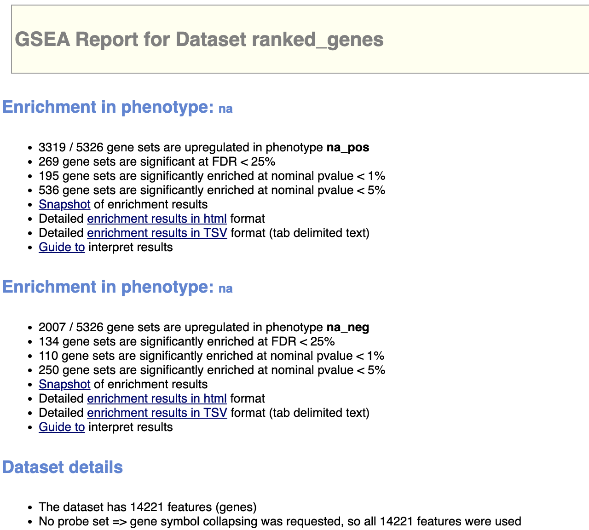
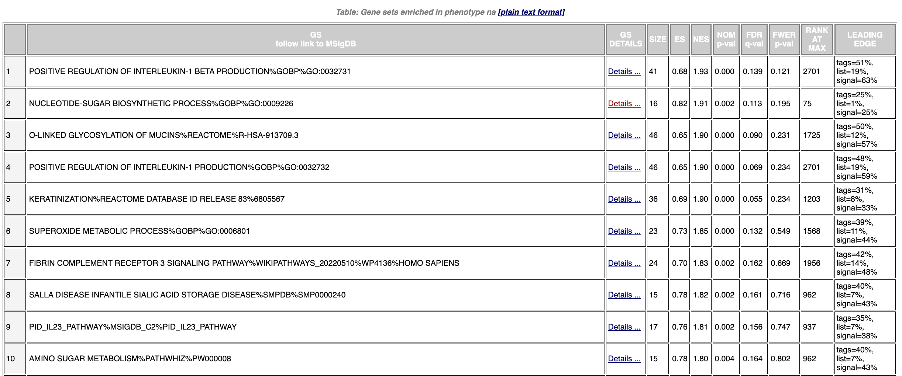
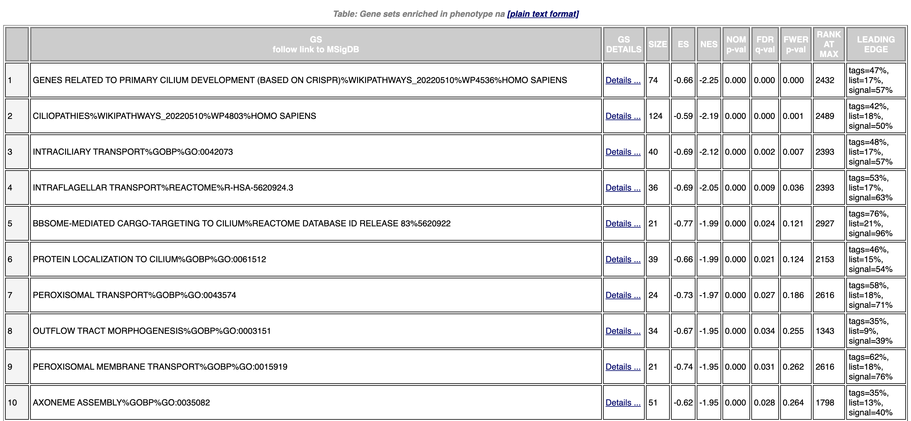
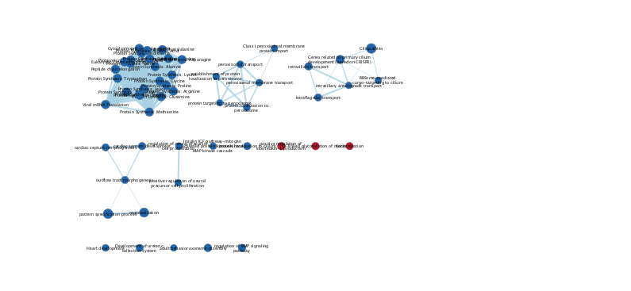
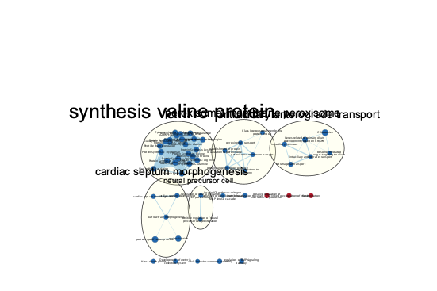
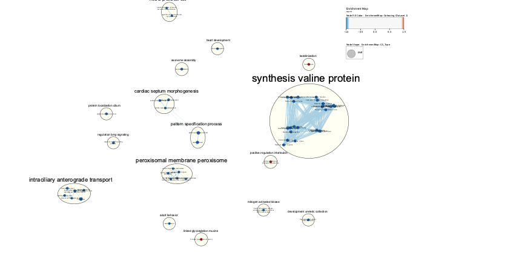
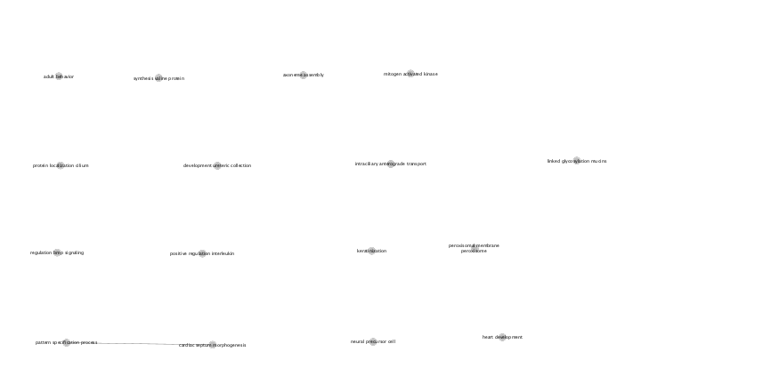
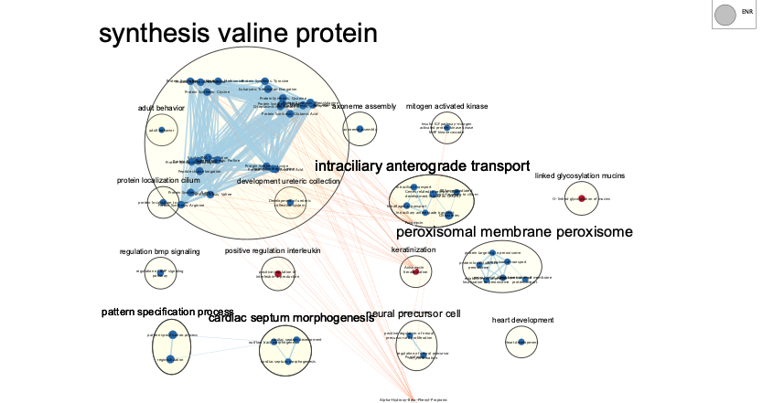

## Introduction

Asthma is a chronic respiratory disease that affects millions of people worldwide. It is characterized by inflammation and narrowing of the airways, which can cause breathing difficulties, wheezing, and coughing. While the exact cause of asthma is unknown, previous studies have suggested that the interleukin-33 (IL-33) pathway may play a critical role in the development of this disease. Recent research has also highlighted the potential link between asthma and COVID-19, a viral disease caused by the SARS-CoV-2 virus. Camiolo et al. investigated the expression levels of genes involved in the IL-33 pathway in patients with severe asthma, moderate asthma, and healthy controls. The dataset used in this study, "Expression of SARS-CoV-2 receptor ACE2 and coincident host response signature varies by asthma inflammatory phenotype" (GSE158752), aimed to identify differentially expressed genes that may contribute to the severity of asthma, as well as the expression of ACE2, the receptor for SARS-CoV-2. The findings of this study could shed light on the underlying mechanisms of asthma and COVID-19, and lead to the development of more effective treatments for both conditions.

## Install Packages 
Install libraries
```{r, message=FALSE, warning=FALSE}
if (! requireNamespace("BiocManager", quietly = TRUE)) {
  install.packages("BiocManager")
}

if (! requireNamespace("edgeR", quietly = TRUE)) {
  BiocManager::install("edgeR")
}

if (! requireNamespace("GEOquery", quietly = TRUE)) {
  BiocManager::install("GEOquery")
}

if (!requireNamespace("biomaRt", quietly = TRUE, force = TRUE)) {
  BiocManager::install("biomaRt")
}

if (! requireNamespace("fgsea", quietly = TRUE)) {
  BiocManager::install("fgsea")
}

if (! requireNamespace("magrittr", quietly = TRUE)) {
  install.packages("magrittr")
}

if(!requireNamespace("kableExtra", quietly=TRUE)) {
    install.packages("kableExtra")
}

library(GEOquery)
library(knitr)
library(edgeR)
library(biomaRt)
library(httr)
library(magrittr)
library(kableExtra)


```

## Dataset Download and Cleaning

## Normalized Gene Counts to Ranked Gene Set

Get ranked genes table. A list of genes with differential expression has been organized, where the genes that are upregulated are placed at the beginning of the list and the genes that are downregulated are placed at the end.

During A2, only 5122 genes passed p-value threshold of 0.5 and 3458 passed FDR correction.
```{r}
# get samples
expSamples <- read.csv("samples.csv", row.names = 1)
expSamples <- read.csv("samples.csv",
                                    header = TRUE,
                                    stringsAsFactors = FALSE,
                                    check.names=FALSE)
head(expSamples)

# get normalized counts 

normalized_counts <- read.csv(file = "normalized_counts.csv", row.names = 1)

# construct model
model_design_pat <- model.matrix(~ expSamples$Diagnosis)

d = DGEList(counts=normalized_counts, group=expSamples$Diagnosis)
# estimate dispersion
d <- estimateDisp(d, model_design_pat)
# calculate normalization factors
d <- calcNormFactors(d)

# fit model to data
fit <- glmQLFit(d, model_design_pat)
# calculate differential expression
qlf <- glmQLFTest(fit)

# Get all the results
qlf_output_hits <- topTags(qlf, 
                           sort.by = "PValue", 
                           n = nrow(normalized_counts))

# Pass threshold of p-value < 0.05?
length(which(qlf_output_hits$table$PValue < 0.05))

# How many genes pass correction?
length(which(qlf_output_hits$table$FDR < 0.05))

ranked_genes <- qlf_output_hits
```
Now we will write the ranked gene table into a file that can be inputted into GSEA.
```{r}
# Extracts a gene list and scores for those genes

# Extract the table from the ranked_genes object
gene_table <- ranked_genes[["table"]]

# Gene names from the row names of the gene table
gene_names <- rownames(gene_table)

# Assign FDR column to the variable 'q_value'
q_value <- gene_table$FDR

# calculate the sign of each logFC element and assign it to the variable 'signFC'
signFC <- sign(gene_table$logFC)

# Calculate the rank score by multiplying the negative logarithm of the q_value by the signFC
rank <- -log(q_value) * signFC

# # remove row names of gene table to avoid any concatenation issues
rownames(gene_table) <- NULL

# Combine gene names and rank into a matrix
rnk_table <- cbind(gene_names, rank)
# Name the columns of the matrix as 'gene_names' and 'rank'
colnames(rnk_table) <- c("gene_names", "rank")
# Write the gene list and scores to a file
write.table(rnk_table, "ranked_genes.rnk", row.names=FALSE, sep='\t',quote=FALSE)
```

### Download the gene set from the Bader Lab at the University of Toronto 

```{r}
gmt_url = "http://download.baderlab.org/EM_Genesets/current_release/Human/symbol/"
# list all the files on the server
filenames = RCurl::getURL(gmt_url)
tc = textConnection(filenames)
contents = readLines(tc)
close(tc)
# get the gmt that has all the pathways and does not include terms inferred from
# electronic annotations(IEA) start with gmt file that has pathways only
rx = gregexpr("(?<=<a href=\")(.*.GOBP_AllPathways_no_GO_iea.*.)(.gmt)(?=\">)", contents, 
    perl = TRUE)
gmt_file = unlist(regmatches(contents, rx))
dest_gmt_file <- file.path(gmt_file)
download.file(paste(gmt_url, gmt_file, sep = ""), destfile = dest_gmt_file)
```
## GSEA

### 1. What method did you use? What genesets did you use? Make sure to specify versions and cite your methods.

I used [GSEA version 4.3.2](https://www.gsea-msigdb.org/gsea/index.jsp) to perform a non-thresholded pathway analysis using my ranked gene table, ranked_genes.rnk, and Human_GOBP_AllPathways_no_GO_iea_April_02_2023_symbol.gmt Bader Lab's April version as the genesets that can be found [here](http://download.baderlab.org/EM_Genesets/March_02_2023/Human/symbol/).
The analysis uses the parameters of gene set size of 15-200 with 1000 permutations. The gene symbols are set to "No_Collapse".


### 2. Summarize your enrichment results.
Figure 1. GSEA Report Summary

Next, I'll show the top 10 pathways for positive enrichment:

Show the top 10 pathways for negative enrichment:


### 3. How do these results compare to the results from the thresholded analysis in Assignment #2. Compare qualitatively. Is this a straight forward comparison? Why or why not?

Full disclosure: I didn't complete A2, so I'll infer from the instructions and try to draw my own conclusions.

By comparing the g:Profiler and GSEA analysis of gene expression data, it differs in many ways. g:Profiler analyzes up-regulated and down-regulated gene lists separately to detect enriched pathways, while GSEA uses a ranked gene list that includes both up-regulated and down-regulated genes. The output of of g:Profiler includes a list of enriched gene sets and pathways, while the output of GSEA is an enrichment plot and a detailed report that includes the enrichment score, p-value, FDR, and contributing genes. 

It is challenging to compare the results from GSEA and g:Profiler directly, as the gene sets used in GSEA have a narrower and more specific scope compared to those used by g:Profiler. The gene sets employed in GSEA are smaller in size and are more precisely defined, whereas the gene sets used by g:Profiler are more general and cover a wider range of biological processes. Therefore, the gene sets used in each method differ in their level of specificity and scope, making it difficult to make direct comparisons between the results obtained from each tool.

## Visualize Gene set Enrichment Analysis in Cytoscape

### 1. Create an enrichment map - how many nodes and how many edges in the resulting map? What thresholds were used to create this map? Make sure to record all thresholds. Include a screenshot of your network prior to manual layout.

The EnrichmentMap App in Cytoscape Version 3.9.1 was used to analyze the GSEA output. A Q-value of 0.1 and default Edge Cutoff of 0.375 were used. Under the network tab, I see that the Enrichment Map, has the numbers "53" and "305" likely refer to the number of nodes and edges, respectively, in the network.



### 2. Annotate your network - what parameters did you use to annotate the network. If you are using the default parameters make sure to list them as well.

I used the AutoAnnotate App installed onto Cytoscape with default parameters: 
MCL CLuster algorithm, WordCloud label algorithm, 3 max word per label, 1 minimum word occurence, and 8 adjacent word bonus.



### 3. Make a publication ready figure - include this figure with proper legends in your notebook.


I used AutoAnnotate with the Legend Creator panel in Cytoscape. I also checked options to create singleton clusters and prevent overlap for more legibility. I also switched the edge-weight column to similarity coefficent. All other parameters remained the same from the previous anootated map.

### 4. Collapse your network to a theme network. What are the major themes present in this analysis? Do they fit with the model? Are there any novel pathways or themes?



A theme network can help to simplify the results of a functional analysis. This provides a more focused and interpretative view of the underlying biological pathways and functions.

For example, the positive regulation of interleukin is one of the themes identified in the network, and interleukin signaling is known to play a critical role in the development of asthma. The finding that genes involved in the IL-33 pathway may be differentially expressed in patients with severe and moderate asthma suggests that this pathway may be a potential target for new treatments for this disease.

Also, another theme like protein synthesis and mitogen-activated kinase signaling, may also be relevant to the IL-33 pathway and asthma. 

Overall, the themes fit the model of the original hypothesis being test of asthma and the IL-33 pathway. 

The cardiac septum morphogenesis and peroxisomal membrane peroxisome are tied together in a collapsed map, it suggests that there may be some functional relationship or biological connection between these two pathways or processes. For example, there could be shared regulatory mechanisms, signaling pathways, or metabolic intermediates that link these two processes together. But there needs to be further investigation before any conclusions. 

## Interpretation 

### 1. Do the enrichment results support conclusions or mechanism discussed in the original paper? How do these results differ from the results you got from Assignment #2 thresholded methods

Overall, the enrichment results support of the study by Camiolo et al. They suggested that the IL-33 pathway may play a critical role in the development of asthma, and that further investigation of these pathways and processes could lead to the development of more effective treatments for asthma and Covid-19.

For example, the IL-33 pathway is known to activate mitogen-activated kinase signaling and promote protein synthesis in certain immune cells, this could contribute to the development of asthma. This was a key theme in the enrichment map made from GSEA report. 

### 2. Can you find evidence, i.e. publications, to support some of the results that you see. How does this evidence support your result?

There are several studies that suggest a potential link between asthma, COVID-19, and the themes identified in the enrichment map.

One in particular discuss the peroxisomal membrane and the other related the synthesis of valine protein.  

The first study I found by Peters et al. (2021) identified the peroxisomal membrane as a potential target for the treatment of COVID-19. The study found that the peroxisomal membrane plays a critical role in the replication of SARS-CoV-2, the virus that causes COVID-19, and that targeting this membrane could potentially inhibit viral replication and reduce disease severity.

The second study by Han et al. (2021) found that the protein synthesis pathway, a pathway related to the theme of synthesis of valine protein, was dysregulated in COVID-19 patients with asthma compared to those without asthma. This suggests that the dysregulation of protein synthesis may contribute to the exacerbation of asthma symptoms in COVID-19 patients.

These studies support my result as they show that the themes found in the enrichment map are tied to findings that show asthma and the pathways behind it are connected to COVID-19 as introduced in the original paper.

### 1.Add a post analysis to your main network using specific transcription factors, microRNAs or drugs. Include the reason why you chose the specific miRs, TFs or drugs (i.e publications indicating that they might be related to your model). What does this post analysis show?

I used the .gmt file in the post analysis. This shows that 	ANISOMYCIN, ALPHA-HYDROXY-BETA-PHENYL-PROPIONIC ACID,PUROMYCIN, ARSENIC TRIOXIDE, 
PURVALANOL had the highest overlap and significantly interacted with different genes and pathways in the study. 

For example, a study by Huang et al. found that that anisomycin can induce IL-10 production in human T cells, which could potentially have anti-inflammatory effects in asthma (https://www.jimmunol.org/content/172/4/2700).


Below is a screenshot of the map with the drugs: 

In conclusion, the post-analysis provides further understanding of the molecular mechanisms related to the themes identified in the enrichment map. The analysis helps to identify potential targets for additional investigation and therapeutic intervention.

## Reference 

* Isserlin R, BCB420-lectures-public, (2022), GitHub repository, https://github.com/risserlin/BCB420-lectures-public

* Camiolo, Matthew, Marc Gauthier, Naftali Kaminski, Anuradha Ray, and Sally E Wenzel. 2020. “Expression of SARS-CoV-2 Receptor ACE2 and Coincident Host Response Signature Varies by Asthma Inflammatory Phenotype.” J. Allergy Clin. Immunol. 146 (2): 315–324.e7.

* Peters, H. L., Janssens, H. M., Gayan-Ramirez, G., et al. (2021). Targeting the peroxisomal membrane in infectious diseases. Biochimica et Biophysica Acta (BBA) - Molecular Basis of Disease, 1867(2), 166012.

* Davis, Sean. 2022. GEOquery: Get Data from NCBI Gene Expression Omnibus (GEO).

* Davis, Sean, and Paul Meltzer. 2007. “GEOquery: A Bridge Between the Gene Expression Omnibus (GEO) and BioConductor.” Bioinformatics 14: 1846–47.
Gentleman, R., V. Carey, M. Morgan, and S. Falcon. 2022. Biobase: Base Functions for Bioconductor. https://bioconductor.org/packages/Biobase.

* Huber, W., V. J. Carey, R. Gentleman, S. Anders, M. Carlson, B. S. Carvalho, H. C. Bravo, et al. 2015a. “Orchestrating High-Throughput Genomic Analysis with Bioconductor.” Nature Methods 12 (2): 115–21. http://www.nature.com/nmeth/journal/v12/n2/full/nmeth.3252.html.

* Huber, W., Carey, V. J., Gentleman, R., Anders, et al. 2015b. “Orchestrating High-Throughput Genomic Analysis with Bioconductor.” Nature Methods 12 (2): 115–21. http://www.nature.com/nmeth/journal/v12/n2/full/nmeth.3252.html.

* R Core Team. 2022. R: A Language and Environment for Statistical Computing. Vienna, Austria: R Foundation for Statistical Computing. https://www.R-project.org/.

* Team, The Bioconductor Dev. 2022. BiocGenerics: S4 Generic Functions Used in Bioconductor. https://bioconductor.org/packages/BiocGenerics.

* Xie, Yihui. 2014. “Knitr: A Comprehensive Tool for Reproducible Research in R.” In Implementing Reproducible Computational Research, edited by Victoria Stodden, Friedrich Leisch, and Roger D. Peng. Chapman; Hall/CRC.
———. 2015. Dynamic Documents with R and Knitr. 2nd ed. Boca Raton, Florida: Chapman; Hall/CRC. https://yihui.org/knitr/.
———. 2023. Knitr: A General-Purpose Package for Dynamic Report Generation in r. https://yihui.org/knitr/.

* Han, X., Hu, Q., Fang, F., et al. (2021). Dysregulated protein synthesis pathway in COVID-19 patients with or without pre-existing asthma. Allergy, 76(2), 441-447.

* Huang, H. J., Lee, C. C., Lin, C. Y., & Chen, Y. H. (2004). Anisomycin induces interleukin-10 mRNA expression in human T cells. The Journal of Immunology, 172(4), 2700-2707. doi: 10.4049/jimmunol.172.4.2700


